# [📁 Original Github](https://github.com/Adi-km/EyeVein)

# 🧠 VeinScope – Tear Vein Pattern Analysis for Early Disease Mapping

## 🔬 Project Overview

**VeinScope** is a deep learning-powered system that focuses on analyzing close-up images of the human eye to extract detailed **vein structures from the scleral (tear) region**. These extracted patterns are essential for understanding physiological conditions and mapping early indicators of health risks such as : Vein length, Curviness and Density. 

These features can be predictive of fatigue, dehydration, or liver-related stress.

---

## 🎯 Objectives

* ✅ Accurately segment the **scleral region** from input eye images.
* ✅ Isolate and segment **fine blood vessels** using deep learning.
* ✅ Extract quantifiable features: **length**, **curviness**, **density**.
* 🧩 Lay groundwork for mapping these features to **medical indicators**.

---

## 🖼️ Sample Input

High-resolution RGB close-up eye images from:

* 📁 **SBVPI Dataset** (~1858 annotated images)
* ⬆️ Or user-uploaded via web interface 

---

## 🛠️ Methods & Pipeline

### 1. Image Preprocessing

* **CLAHE**: Local contrast enhancement.
* **Green Channel Extraction**: Boosts vessel visibility.
* **ROI Isolation**: Focus on scleral region.

### 2. Segmentation (Two-Stage)

* **Model**: DeepLabV3+ with ResNet34 backbone
* **Loss Functions**:

  * Binary Cross Entropy (BCE)
  * Dice Loss (to preserve thin structures)

| Stage       | Description                               |
| ----------- | ----------------------------------------- |
| **Stage 1** | Segment the sclera → `stage1.py`          |
| **Stage 2** | Segment veins within sclera → `stage2.py` |

### 3. Feature Extraction

* 🧵 **Vein Length**: Skeletonization
* 🌀 **Curviness**: Contour-based curvature
* 🔳 **Density**: Ratio of vein to sclera pixels
* 🔴 **Redness**: Differential Red Intensity

### 4. Health Mapping

* ML-based health indicator mapping
* Numerical and visual insights

---

## ✅ Evaluation Metrics

| Metric          | Description                                                   | Our Value            |
| --------------- | ------------------------------------------------------------- | -------------------- |
| **Dice Score**  | Measures overlap between prediction and ground truth.         | 0.533907647464024    | 
| **SSIM**        | Assesses structural similarity between two images.            | 0.9779788919104669   |
| **PSNR**        | Evaluates image reconstruction quality (higher is better).    | 70.22066102478281    |
| **MSE**         | Average squared error between predicted and true values.      | 0.007259247933862208 |
| **NCC**         | Measures similarity between image regions.                    | 0.534853588555341    |

---

## 📊 Dataset

* 📦 **SBVPI Dataset**
* 🖼️ ~1858 high-res images with annotations
* 🎯 Labels include: **sclera**, **canthus**, **eyelashes**, **vessels**, **iris**, **pupil**, **periocular**
* 🌐 Publicly available

---

## 🔧 Repository Structure & File Functionality

```
redeye2/
│
├── stage/
│   ├── _init_.py
│   ├── main.py                # Main pipeline runner (executes Stage 1 and Stage 2)
│   ├── stage1.py              # Sclera segmentation model and processing logic
│   ├── stage2.py              # Vein segmentation model and processing logic
│   ├── images
├   ├── I_O_images
│
├── pipeline.ipynb             # Complete end-to-end notebook for both segmentation stages
├── stage1.ipynb               # Test and visualize scleral segmentation (Stage 1)
├── stage2.ipynb               # Test and visualize vein segmentation (Stage 2)
|
├── README.md
│
├── stage1_weights.pth    # Trained DeepLabV3+ model after 5 epochs
├── stage2_weights.pth   # Final trained model after 50 epochs (used for deployment)
```

---

### `Saved Weights`

* `stage1_weights.pth`: Weights for stage1 (Sclera Segmentation)
* `stage2_weights.pth`: Weights for stage2 (Vessels Segmentation)

Used by both segmentation stages during inference.

---

### 📁 `stage/`

#### `stage1.py`

* **Purpose**: Sclera segmentation
* **Functions**:

  * Resize, CLAHE, isolate ROI
  * Load trained DeepLabV3+ model
  * Return binary sclera mask

#### `stage2.py`

* **Purpose**: Vein segmentation inside sclera
* **Functions**:

  * Use mask from Stage 1
  * Further preprocess (CLAHE, green channel)
  * Predict vein structures within sclera

#### `main.py`

* **Purpose**: Command-line pipeline runner
* **Usage**:

  ```bash
  python main.py --input eye.jpg --output output_mask.png
  ```
* Internally calls both `stage1.py` and `stage2.py`

---

### 📓 Notebooks

#### `pipeline.ipynb`

* Full two-stage pipeline execution
* Visualizes all steps: Image → Sclera → Veins

#### `stage1.ipynb`

* Run and test Stage 1 independently

#### `stage2.ipynb`

* Run and test Stage 2 with manual sclera masks

---

## 📦 Installation

Install all Python requirements:

```bash
pip install -r requirements.txt
```

### Required Libraries

* `torch`, `torchvision`
* `opencv-python`, `Pillow`
* `segmentation-models-pytorch`
* `matplotlib`, `numpy`, `scikit-learn`

---

## 🧪 How to Run

### Option 1: Command Line

```bash
python main.py --input eye.jpg --output output_mask.png
```

### Option 2: Notebooks

Use the notebook `pipeline.ipynb` to test and visualize the full segmentation pipeline end-to-end.

---

### Input Image -> Segmented Sclera -> Segmented Vessels -> Output Image


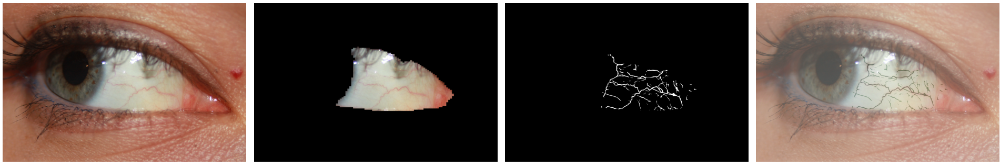
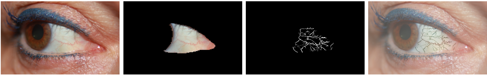
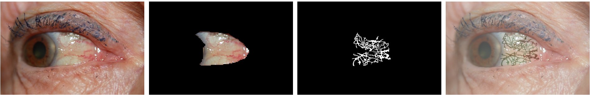
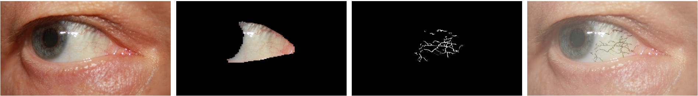
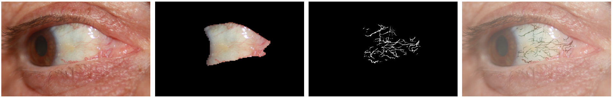

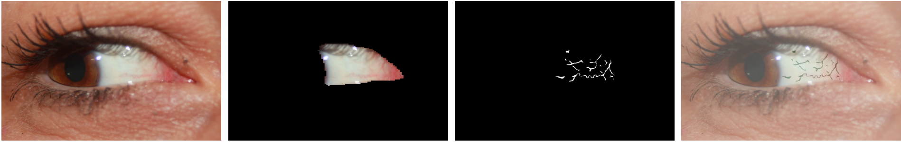
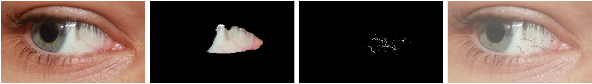
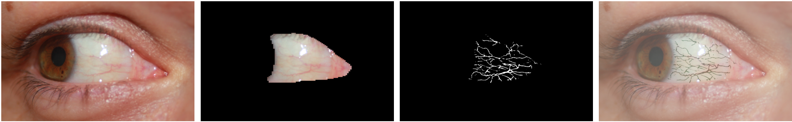
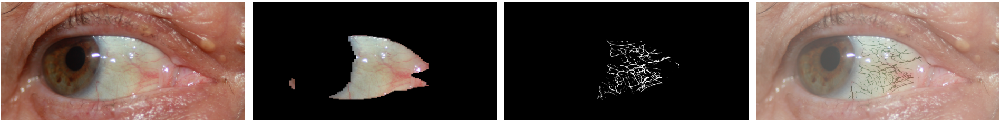
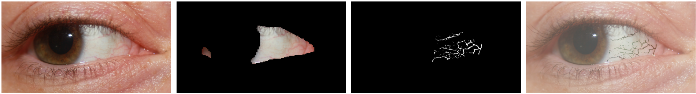
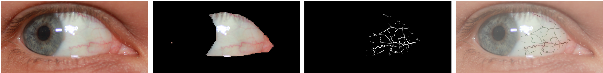
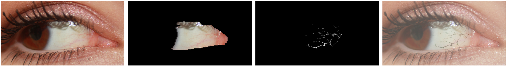
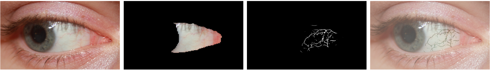

---

## 🧪 Uses

### App

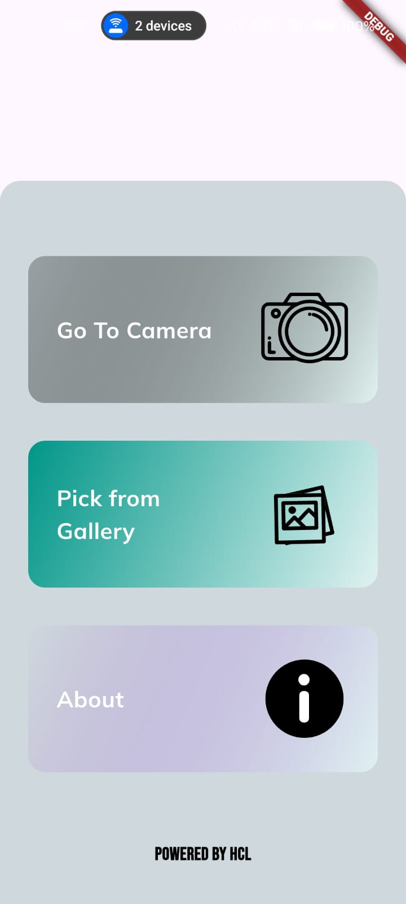
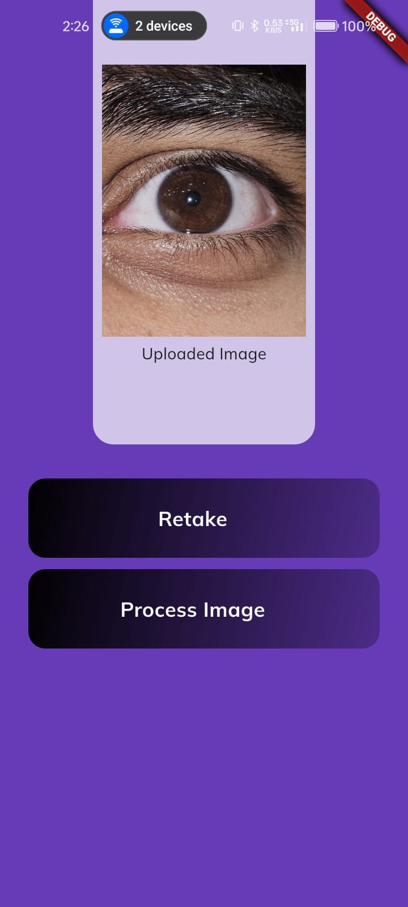
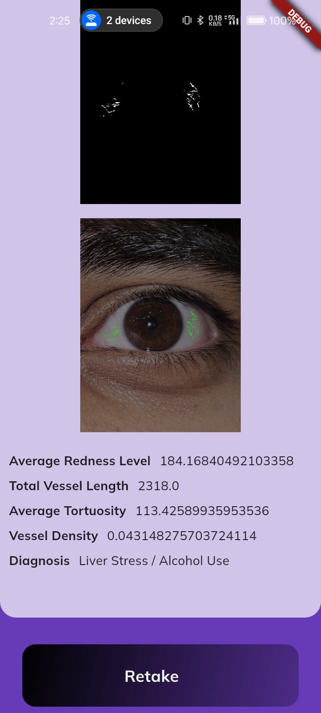

### Website

### [🔗 Website](https://veinscope.netlify.app)

